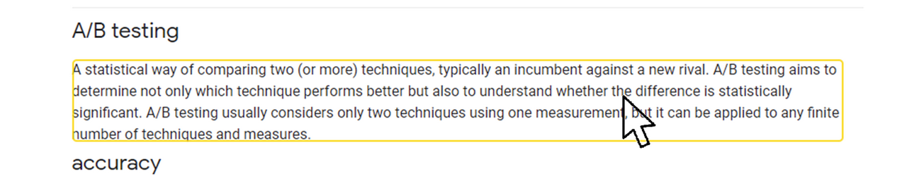
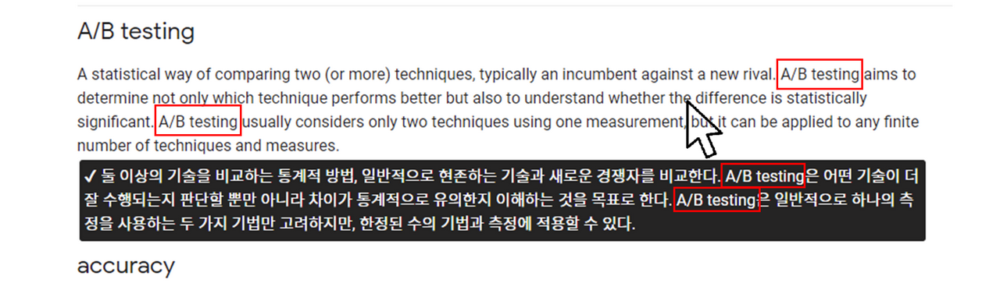

# On the spot Translator (Chrome Extension)

**Chrome extension** for **on the spot Translator**

**Just click and get the translation right below which keeps named entity in the original text.**

Install from ["On the spot Translator" page in Chrome Web Store](https://chrome.google.com/webstore/detail/on-the-spot-translator/bgljcgcfhppljahbdkfgeldgfdjknpfa)

## Usage & Features

- Hold down **Alt key** and **move the mouse cursor over** the desired text to translate.
	
	Then you **can see the yellow box** that tells you the range of the text.
	
	

- **By one click**(with Alt), you can **see the translation right below the original text** 

  - In other words, you can **see the original and the translation at a glance**. So simple!
  - Above all, the result **keeps named entity in the original text**.
    This will help you understand the original text better, **especially with many jargon.**

  

- Currently, support English to Korean and Korean to English translation.

## Installation & Setting

1. Download the ["On the spot Translator" in Chrome Web Store](https://chrome.google.com/webstore/detail/on-the-spot-translator/bgljcgcfhppljahbdkfgeldgfdjknpfa)

2. Get a Naver Papago API key and enter Put it in the extension option.

   This extension based on Naver Papago API. So you should
   
   - Get the application `Client ID` and `Client Secret` of Naver developers center.
   - Enter them in this extension option.

For more detailed, see [this link](https://www.notion.so/uoneway/On-the-spot-Translator-1826d87aa2d845d093793cee0ca11b29).

## Update plan

- In progress...
  - Improve NER logic
  - Support multi-language
  - Apply Google translation supplementary for exceed the usage limit of Naver papago.
- Planning
  - Improve response speed
  - Apply for pdf
  - Improve NER logic
    - Make User-defined or domain-specific dictionary function
    - Code detection
    - Correct postposition after substitution token

## Related Project

- The main part of the text processing is performed on REST-API server.

  

- The text extraction function from HTML is based on the [copy-text-without-selecting-chrome](https://github.com/YujiSoftware/copy-text-without-selecting-chrome) of [YujiSoftware](https://github.com/YujiSoftware). 